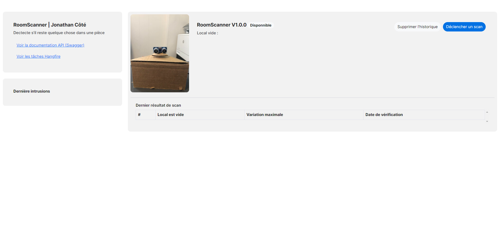
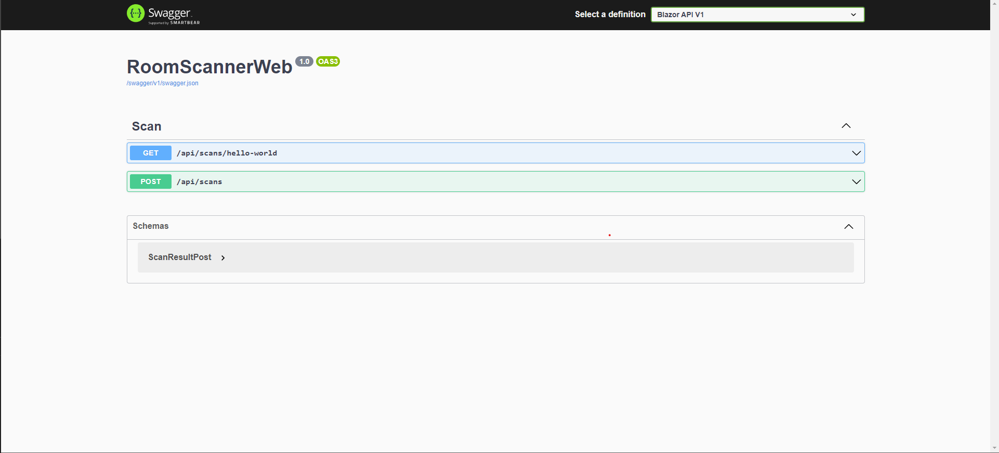

# RoomScanner

## Introduction

Projet pour valider qu'une pièce est vide. Le projet est composé d'un **Arduino** qui scanne la pièce et d'une **API** qui enregistre les scans et les affiche sur une **application Web**. Lorsque l'arduino s'ouvre il fait une premier scan pour se faire une idée de la pièce. Puis il scanne la pièce toutes les 5 secondes. Si la pièce est vide, il envoie un signal à l'API qui enregistre le scan.

## API

L'api et l'application Web ont été développées en **Blazor Server**. 

### Lancer l'application

Pour lancer l'application, ouvrez le fichier `RoomScanner.sln` avec Visual Studio 2022 et lancez le projet `RoomScanner.Api`. 

### Preview

L'application Web utilise les websockets et donc les derniers scans sont affichés en temps réel.

### Documentation de l'API

La documentation de l'API est disponible à l'adresse suivante : [https://localhost:5001/swagger/index.html](https://localhost:5001/swagger/index.html)

## Arduino

Le code de l'arduino a été dévelloper avec **PlatformIO** ce qui permet de faire une meilleur gestion de packages +++. 

### Lancer le code

1. Installez **PlatformIO** sur votre IDE préféré (Visual Studio Code, Atom, etc...)

2. Ouvrez le projet dans le dossier `objet`

3. Connectez l'arduino à votre ordinateur

4. Compilez et téléversez le code sur l'arduino